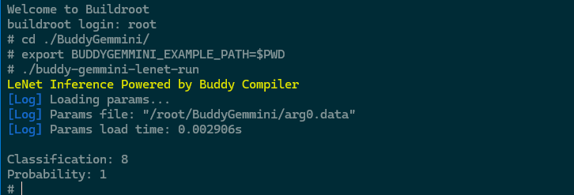

# BuddyGemmini LeNet E2E deployment on Firesim

## Overview
This guide provides an example of end-to-end deployment of a DNN (LeNet) inference to a DSA backend (Gemmini) using the Buddy Compiler. 

We use FireSim, a platform for FPGA-accelerated cycle-accurate simulation, to run end-to-end DNN workloads that would take too long to run on Verilator/VCS. FireSim also allows users to check that their Gemmini hardware/software will work when running in a Linux environment. The FireSim used in this guide is installed locally on a Xilinx Alveo U280.

## Preparation
Before proceed any further make sure that you installed dependencies below
1. Installation of [Buddy-mlir basic environment and cross-compilation toolchain](https://github.com/buddy-compiler/buddy-mlir/blob/main/docs/RVVEnvironment.md)
   
2. Environment installation for [Chipyard](https://chipyard.readthedocs.io/en/1.11.0/) and [Firesim](https://docs.fires.im/en/1.18.0/). The environment for this guide is based on a local acceleration card, the Xilinx Alveo U280, with configuration versions Chipyard 1.11.0 and FireSim 1.18.0. We recommend installing these versions (install firesim as a submodule of chipyard) and completing all the content in the FireSim documentation's [Getting Started Guide](https://docs.fires.im/en/1.18.0/Getting-Started-Guides/On-Premises-FPGA-Getting-Started/Repo-Setup/Xilinx-Alveo-U280.html).
   
3. Complete the build of [gemmini](https://github.com/ucb-bar/gemmini), and building a complete bitstream file based on the default Gemmini configuration using the firesim buildbitstream command.

## Cross-compilation
1. Activate your python environment.
   
2. Set the environment variable.
    
Make sure you are in the BuddyGemmini directory. 

```
export BUDDYGEMMINI_EXAMPLE_PATH=$PWD
```

3. Build buddy-gemmini-lenet-run
   
```
$ mkdir build && cd build
$ cmake .. -DBUDDY_MLIR_DIR=/path/to/buddy-mlir/ # replace with your buddy-mlir directory path
$ make buddy-gemmini-lenet-run
```

## Deployment to FireSim
1. Copy the executable files (located in the `BuddyGemmini/build/`) and the required data files to Gemmini's software path
```
$ cd chipyard # go to your chipyard root directory 
$ mkdir ./generators/gemmini/software/overlay/root/BuddyGemmini/
$ cp ${BUDDYGEMMINI_EXAMPLE_PATH}/build/buddy-gemmini-lenet-run  ./generators/gemmini/software/overlay/root/BuddyGemmini/
$ cp ${BUDDYGEMMINI_EXAMPLE_PATH}/arg0.data  ./generators/gemmini/software/overlay/root/BuddyGemmini/
$ cp -r ${BUDDYGEMMINI_EXAMPLE_PATH}/images/  ./generators/gemmini/software/overlay/root/BuddyGemmini/
```
2. Build software for the target platform
```
$ cd chipyard
$ ./sims/firesim/sw/firesim-software/marshal -v build ./generators/gemmini/software/gemmini-tests-interactive.json && ./sims/firesim/sw/firesim-software/marshal -v install ./generators/gemmini/software/gemmini-tests-interactive.json
```

3. Activate your Firesim environment.
```
$ cd chipyard/sim/firesim 
$ source ./sourceme-manager.sh --skip-ssh-setup
```

4. In the `firesim/deploy/` path, there are four files that configure key information for FireSim's build workload, bitstream, runtime, etc. Please check the following configurations:

- `config_build_recipes.yaml`: Configures the Gemmini configuration, such as `firesim_custom_gemmini_rocket_singlecore_no_nic`
- `config_build.yaml`: Under `builds_to_run`, select the Gemmini configuration, such as `firesim_custom_gemmini_rocket_singlecore_no_nic`
- `config_hwdb.yaml`: For `bitstream_tar`, configure the absolute path where your generated Gemmini bitstream is stored
- `config_runtime.yaml`: This file is for building the runtime. Please modify the `workload_name` to `gemmini-tests-interactive.json`. We will execute this interactive configuration after starting the simulation later.


5. Build and deploy simulation infrastructure to the Run Farm Machines. Each time you change your workload content, please re-execute `step 2` to `step 5`.

```
$ firesim infrasetup
```

6. Start simulation on Run Farm Machines. After executing the command below, the terminal will display a background monitor of the simulation running.

```
$ firesim runworkload
```

7. SSH connect to `BUILD_FARM_IP`, open a new terminal connection to the screen created by Run Farm Machines (please refer to the FireSim documentation to confirm you can correctly connect to Run Farm Machines).
   
```
$ ssh BUILD_FARM_IP
$ screen -r fsim0
```

## Final step!
Now, you can login to the system! The username is root and there is no password. The steps described here are for manual execution. You can also refer to the writing of `gemmini-tests.json` and `overlay/root/run-tests.sh` to write your own automated execution script. This will change the manual operations after firesim runworkload to automatic execution. The corresponding log files will be recorded in the `/firesim/deploy/results-workload` folder.

```
$ cd ./BuddyGemmini
$ export BUDDYGEMMINI_EXAMPLE_PATH=$PWD
$ ./buddy-gemmini-lenet-run
```

If all steps go well, you will see the output below. Good luck.

