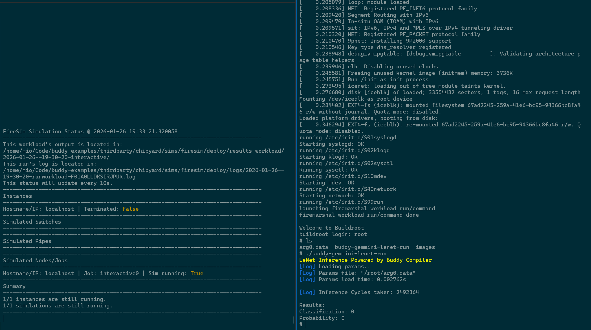
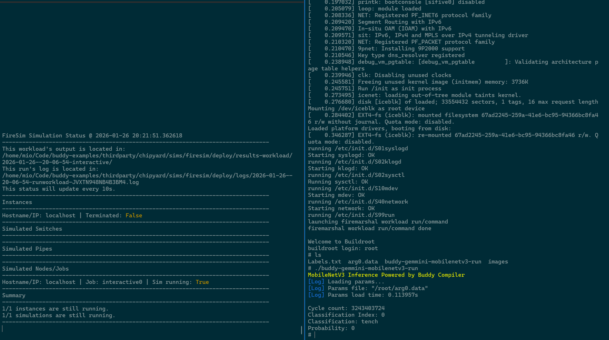

# buddy-examples

This repository demonstrates buddy-mlir capabilities through selected representative workloads running on Chipyard 1.13.1 platform. These example models are lowered to Gemmini Dialect by buddy-mlir, where Gemmini is a DNN accelerator integrated in Chipyard. The workloads are simulated using tools provided by Chipyard: the FireSim FPGA-accelerated simulation.

## Quick Start

1. Environment Dependencies

Before getting started, please ensure your system meets the following dependency requirements:

- Anaconda/Miniconda (environment management)
- Ninja Build System

2. Initialize repository in one step:

```bash
git clone https://github.com/buddy-compiler/buddy-examples.git
cd buddy-examples
./scripts/init.sh
```

3. Activate environment

```bash
# buddy environment
cd buddy-examples
source ./env.sh

# firesim environment
cd buddy-examples/thirdparty/chipyard/sims/firesim
source ./env.sh
source ./sourceme-manager.sh --skip-ssh-setup
cd ~/.ssh
ssh-agent -s > AGENT_VARS
source AGENT_VARS
ssh-add firesim.pem
``` 

4. Build hardware in FireSim

We have tested these examples on VCU118 and Alveo U280 platforms.

- Configuration setup
    - replace [`default_build_dir`](sims/firesim/yaml/config_build.yaml) with your desired directory path for storing generated bitstream files.
    - replace [`default_simulation_dir`](sims/firesim/yaml/config_runtime.yaml) with your desired directory path for storing simulation-related files.

- Generate bitstream and run simulation

```bash
./sims/firesim/build-firesim.sh
```

Build the FPGA bitstream and launch FireSim simulations. The bitstream generation process may take several hours depending on your hardware configuration.

```bash
cd buddy-examples
source ./env.sh
``` 

> **Note:** This guide assumes you have basic knowledge of FireSim. For detailed FireSim configuration instructions, please refer to the [official FireSim documentation](https://docs.fires.im).


Then, you can start running the examples below.

## Examples

### Example 1: LeNet-Gemmini
This example uses the LeNet model with the MNIST dataset. Note that the build process will automatically download the dataset and train the model locally before building workloads, which may take some time.

1. Build Workloads

```bash
cd buddy-examples
source ./env.sh
./sims/marshal/build-image.sh lenet-gemmini
```

2. Simulation in firesim

```bash
# activate firesim environment
cd buddy-examples/thirdparty/chipyard/sims/firesim
source ./env.sh
source ./sourceme-manager.sh --skip-ssh-setup
cd ~/.ssh
ssh-agent -s > AGENT_VARS
source AGENT_VARS
ssh-add firesim.pem

cd buddy-examples
./sims/firesim/run-firesim.sh
```

3. Monitor simulation process in a new terminal

```bash
ssh localhost
screen -r fsim0 
```

4. Final step!
Now, you can login to the system! The username is root and there is no password. The steps described here are for manual execution. The corresponding log files will be recorded in the `/firesim/deploy/results-workload` folder.

```bash
$ ./buddy-gemmini-lenet-run
```

If all steps go well, you will see the output below. Good luck.



### Example 2: ResNet18-Gemmini

1. Build Workloads

```bash
cd buddy-examples
source ./env.sh
./sims/marshal/build-image.sh resnet-gemmini
```

2. Simulation in firesim

```bash
# activate firesim environment
cd buddy-examples/thirdparty/chipyard/sims/firesim
source ./env.sh
source ./sourceme-manager.sh --skip-ssh-setup
cd ~/.ssh
ssh-agent -s > AGENT_VARS
source AGENT_VARS
ssh-add firesim.pem

cd buddy-examples
./sims/firesim/run-firesim.sh
```

3. Monitor simulation process in a new terminal

```bash
ssh localhost
screen -r fsim0 
```

4. Final step!
Now, you can login to the system! The username is root and there is no password. The steps described here are for manual execution. The corresponding log files will be recorded in the `/firesim/deploy/results-workload` folder.

```bash
$ ./buddy-gemmini-resnet-run
```

If all steps go well, you will see the output below. Good luck.


### Example 3: MobileNetv3-Gemmini
1. Build Workloads

```bash
cd buddy-examples
source ./env.sh
./sims/marshal/build-image.sh mobilenetv3-gemmini
```

2. Simulation in firesim

```bash
# activate firesim environment
cd buddy-examples/thirdparty/chipyard/sims/firesim
source ./env.sh
source ./sourceme-manager.sh --skip-ssh-setup
cd ~/.ssh
ssh-agent -s > AGENT_VARS
source AGENT_VARS
ssh-add firesim.pem

cd buddy-examples
./sims/firesim/run-firesim.sh
```

3. Monitor simulation process in a new terminal

```bash
ssh localhost
screen -r fsim0 
```

4. Final step!
Now, you can login to the system! The username is root and there is no password. The steps described here are for manual execution. The corresponding log files will be recorded in the `/firesim/deploy/results-workload` folder.

```bash
$ ./buddy-gemmini-mobilenetv3-run
```

If all steps go well, you will see the output below. Good luck.




### Example 4: BERT-Gemmini

**Notes** The current sequence length limit is set to 5 tokens for test, which can be increased appropriately (the model's maximum limit is 512).

1. Build Workloads

```bash
cd buddy-examples
source ./env.sh
./sims/marshal/build-image.sh bert-gemmini
```

2. Simulation in firesim

```bash
# activate firesim environment
cd buddy-examples/thirdparty/chipyard/sims/firesim
source ./env.sh
source ./sourceme-manager.sh --skip-ssh-setup
cd ~/.ssh
ssh-agent -s > AGENT_VARS
source AGENT_VARS
ssh-add firesim.pem

cd buddy-examples
./sims/firesim/run-firesim.sh
```

3. Monitor simulation process in a new terminal

```bash
ssh localhost
screen -r fsim0 
```

4. Final step!
Now, you can login to the system! The username is root and there is no password. The steps described here are for manual execution. The corresponding log files will be recorded in the `/firesim/deploy/results-workload` folder.

```bash
$ ./buddy-gemmini-bert-run
```

If all steps go well, you will see the output below. Good luck.


### Example 5: StableDiffusion-Gemmini

**Notes** This model needs to download weights from Hugging Face. Please make sure your environment variables are configured correctly so that Hugging Face can be accessed normally.

1. Build Workloads

```bash
cd buddy-examples
source ./env.sh
./sims/marshal/build-image.sh stablediffusion-gemmini
```

2. Simulation in firesim

```bash
# activate firesim environment
cd buddy-examples/thirdparty/chipyard/sims/firesim
source ./env.sh
source ./sourceme-manager.sh --skip-ssh-setup
cd ~/.ssh
ssh-agent -s > AGENT_VARS
source AGENT_VARS
ssh-add firesim.pem

cd buddy-examples
./sims/firesim/run-firesim.sh
```

3. Monitor simulation process in a new terminal

```bash
ssh localhost
screen -r fsim0 
```

4. Final step!
Now, you can login to the system! The username is root and there is no password. The steps described here are for manual execution. The corresponding log files will be recorded in the `/firesim/deploy/results-workload` folder.

```bash
$ ./buddy-gemmini-stablediffusion-run
```

If all steps go well, you will see the output below. Good luck.


### Example 6: Llama2-Gemmini

**Notes** This model needs to download weights from Hugging Face. Please make sure your environment variables are configured correctly so that Hugging Face can be accessed normally. In addition, please configure your API in this [file](models/models/llama2/CMakeLists.txt).

1. Build Workloads

```bash
cd buddy-examples
source ./env.sh
./sims/marshal/build-image.sh llama2-gemmini
```

2. Simulation in firesim

```bash
# activate firesim environment
cd buddy-examples/thirdparty/chipyard/sims/firesim
source ./env.sh
source ./sourceme-manager.sh --skip-ssh-setup
cd ~/.ssh
ssh-agent -s > AGENT_VARS
source AGENT_VARS
ssh-add firesim.pem

cd buddy-examples
./sims/firesim/run-firesim.sh
```

3. Monitor simulation process in a new terminal

```bash
ssh localhost
screen -r fsim0 
```

4. Final step!
Now, you can login to the system! The username is root and there is no password. The steps described here are for manual execution. The corresponding log files will be recorded in the `/firesim/deploy/results-workload` folder.

```bash
$ ./buddy-gemmini-llama2-run
```

If all steps go well, you will see the output below. Good luck.


### Example 7: DeepSeekr1-Gemmini

**Notes** This model needs to download weights from Hugging Face. Please make sure your environment variables are configured correctly so that Hugging Face can be accessed normally.


1. Build Workloads

```bash
cd buddy-examples
source ./env.sh
./sims/marshal/build-image.sh deepseekr1-gemmini
```

2. Simulation in firesim

```bash
# activate firesim environment
cd buddy-examples/thirdparty/chipyard/sims/firesim
source ./env.sh
source ./sourceme-manager.sh --skip-ssh-setup
cd ~/.ssh
ssh-agent -s > AGENT_VARS
source AGENT_VARS
ssh-add firesim.pem

cd buddy-examples
./sims/firesim/run-firesim.sh
```

3. Monitor simulation process in a new terminal

```bash
ssh localhost
screen -r fsim0 
```

4. Final step!
Now, you can login to the system! The username is root and there is no password. The steps described here are for manual execution. The corresponding log files will be recorded in the `/firesim/deploy/results-workload` folder.

```bash
$ ./buddy-gemmini-deepseekr1-run
```

If all steps go well, you will see the output below. Good luck.
